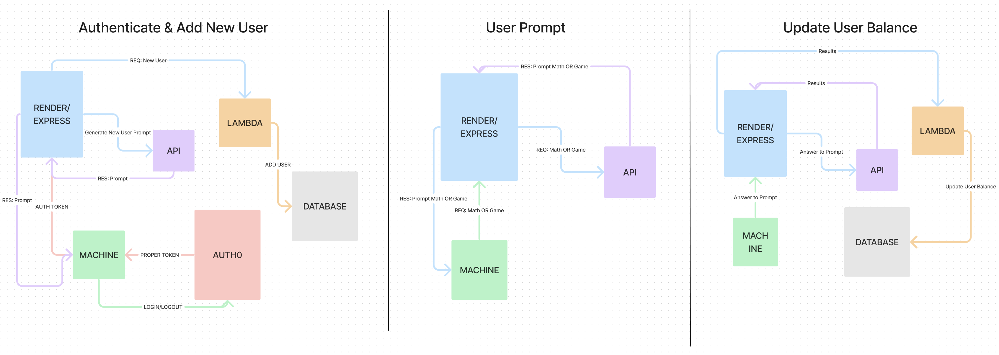

# Termianl Casino

[Trello](https://trello.com/invite/b/6okUcpNm/ATTIf11ffc71f207d100631082e96ba60253417E62EB/t-casino-inc)

## Summary

A solo player text based casino app that encourages the user to have healthier gambling
habits. The user will earn `bits` by solving math equations and use those `bits`
to play casino games.

## Problem Domain

Create a space for users to play casino games without the risk of losing real money,
while formulating a more educational and financially responsible way to gamble.

## MVP

- User can login and create an account
- User can earn `bits` by solving tier based math equations varying in difficulty
  - User earns 1 `bit` for every easy equation solved (addition, subtraction)
  - User earns 10 `bits` for every medium equation solved (multiplication, division)
  - User earns 30 `bits` for every hard equation solved (algebra)
- User can play `WAR` with their `bits`
  - Player must gamble a minimum of 10 `bits` to play
  - Player can win or lose `bits` based on the outcome of the game
- User can request their `bit` balance
- User can lose a maximum of 300 `bits` per day

## Stretch Goals

- User can play `BLACKJACK` with their `bits`
  - Player must gamble a minimum of 10 `bits` to play
  - Player can win or lose `bits` based on the outcome of the game
- Users can play against each other in a `WAR` game
  - Players can chat with each other during the game
